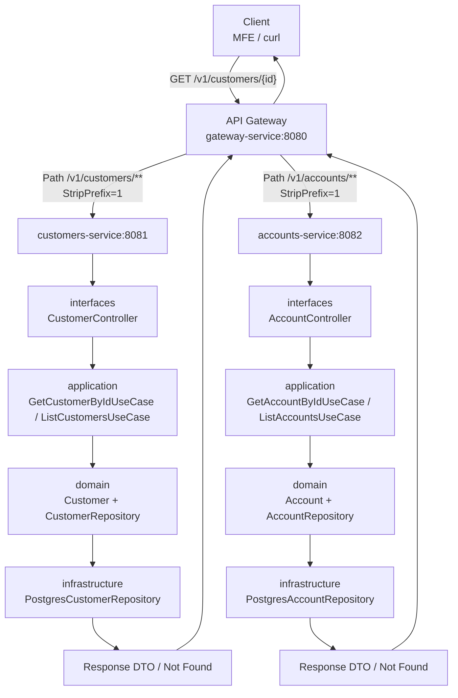
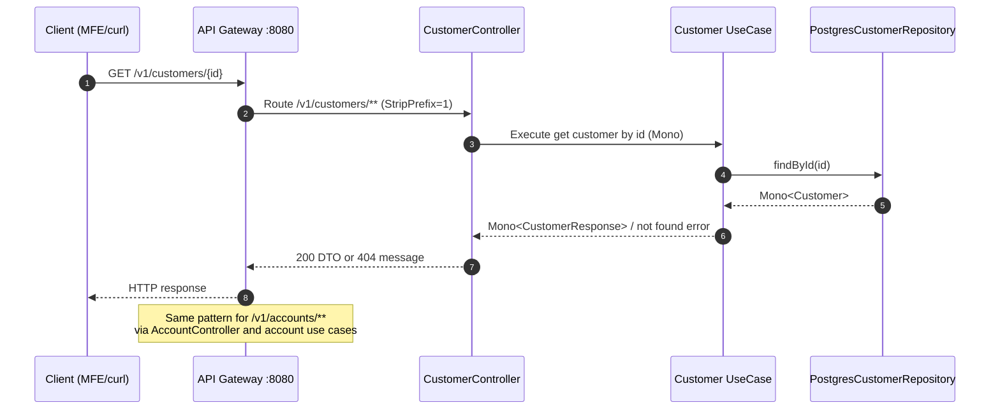

# MSA PoC (Spring Boot + Reactive DDD)

[](https://github.com/mergin/msa-poc/actions/workflows/ci.yml)

Microservices proof-of-concept for the Angular MFE app in `mfe-poc`.

It implements the backend contract used by the frontends for:

- `GET /v1/customers`
- `GET /v1/customers/{id}`
- `GET /v1/accounts`
- `GET /v1/accounts/{id}`
- `GET /v1/accounts/{id}/owner` — cross-service call enriching the account with its owner's customer data
- `GET /v1/transactions` — paginated transaction list
- `GET /v1/transactions/{id}` — single transaction by ID
- `GET /v1/transactions/{accountId}/running-balance` — per-transaction cumulative balance (SQL window function)
- `GET /v1/transactions/{accountId}/monthly-summary` — monthly debit/credit/net aggregation (`GROUP BY DATE_TRUNC`)
- `GET /v1/transactions/top-accounts` — accounts ranked by total volume (`GROUP BY … ORDER BY SUM DESC`)
- `GET /v1/transactions/{accountId}/anomalies` — statistical outliers (amount > mean + 2 × stddev)
- `GET /v1/transactions/search` — multi-criteria dynamic query with optional filters

The project is built with a reactive Spring Boot stack and a DDD-inspired structure.

## Architecture

```text
Angular MFEs (4200/4201/4202)
          |
          v
   API Gateway (8080)
      /v1/customers/**     -> customers-service     (8081)
      /v1/accounts/**      -> accounts-service      (8082)
      /v1/transactions/**  -> transactions-service  (8083)
```

### Microservice request flow schema

```text
Client (MFE / curl)
  |
  | HTTP GET /v1/customers/{id}
  v
API Gateway (gateway-service, 8080)
  |
  | Route by path predicate (/v1/customers/**)
  | StripPrefix=1
  v
customers-service (8081)
  [interfaces] Account/Customer Controller (REST endpoint)
  |
  v
  [application] Use Case (application service)
  |
  v
  [domain] Repository interface + domain model
  |
  v
  [infrastructure] PostgreSQL Repository (R2DBC)
  |
  v
Response DTO (or 404 mapped by ApiExceptionHandler)
  |
  v
API Gateway -> Client
```





Same flow applies to `/v1/accounts/**`, routed to `accounts-service` (8082).

### Modules

- `gateway-service`
  - Spring Cloud Gateway
  - Routes `/v1/customers/**`, `/v1/accounts/**`, and `/v1/transactions/**`
  - Central CORS for local MFE origins
  - JWT authentication via Spring Security OAuth2 Resource Server (HMAC-SHA256)
- `customers-service`
  - Reactive WebFlux API + reactive use cases
  - DDD layers: domain, application, infrastructure, interfaces
  - PostgreSQL adapter via R2DBC (`PostgresCustomerRepository`)
- `accounts-service`
  - Reactive WebFlux API + reactive use cases
  - DDD layers: domain, application, infrastructure, interfaces
  - PostgreSQL adapter via R2DBC (`PostgresAccountRepository`)
  - `infrastructure/client` — `CustomersClient` (WebClient + Resilience4j circuit breaker)
- `transactions-service`
  - Reactive WebFlux API + reactive use cases
  - DDD layers: domain, application, infrastructure, interfaces
  - PostgreSQL adapter via R2DBC with raw `DatabaseClient` for complex analytical queries
  - Window functions, aggregations, statistical anomaly detection, and dynamic multi-filter search

## DDD layering used in each bounded context

Each business service (`customers-service`, `accounts-service`, `transactions-service`) follows this package structure:

- `domain`
  - Entities/value objects and repository interfaces
- `application`
  - Use cases (application services) orchestrating domain operations
- `infrastructure`
  - Reactive PostgreSQL repository implementations (PoC persistence)
- `interfaces`
  - REST controllers, DTOs, and API exception mapping

This keeps transport/infrastructure concerns separate from core domain logic.

## Implemented API contract

### Customers

- `GET /v1/customers`
  - Query params: `page` (default `0`), `size` (default `20`, max `100`)
  - Response: list of `{ id, name, email, status }`
- `GET /v1/customers/{id}`
  - `404` body: `{ "message": "Customer not found" }`

### Accounts

- `GET /v1/accounts`
  - Query params: `page` (default `0`), `size` (default `20`, max `100`)
  - Response: list of `{ id, accountNumber, type, balance, currency, ownerId }`
- `GET /v1/accounts/{id}`
  - `404` body: `{ "message": "Account not found" }`
- `GET /v1/accounts/{id}/owner`
  - Enriches the account with its owner's data fetched reactively from `customers-service`.
  - Response: `{ accountId, accountNumber, ownerId, ownerFirstName, ownerLastName, ownerEmail }`
  - `404` when the account does not exist.
  - `503` when `customers-service` is unreachable (circuit breaker open or fallback empty).

## transactions-service

`transactions-service` (port **8083**) is a dedicated analytical microservice that showcases
complex relational query patterns using Spring Data R2DBC's `DatabaseClient` with raw SQL.

### Domain model

| Field | Type | Notes |
|---|---|---|
| `id` | `String` | UUID primary key |
| `accountId` | `String` | Foreign key to accounts domain |
| `type` | `TransactionType` | `CREDIT` or `DEBIT` |
| `amount` | `BigDecimal` | Positive decimal |
| `currency` | `String` | ISO-4217 code (e.g. `EUR`) |
| `description` | `String` | Free-text label |
| `timestamp` | `LocalDateTime` | Transaction time |
| `category` | `String` | e.g. `GROCERIES`, `SALARY` |

Seed data: **1 000 rows** across 5 accounts via `generate_series` in `data.sql`.
Every 47th row has an outlier amount (×10) to ensure the anomaly-detection endpoint returns results.

### Endpoints and SQL techniques

| Endpoint | Method | SQL technique |
|---|---|---|
| `/transactions` | GET | Simple `ORDER BY` + `LIMIT`/`OFFSET` |
| `/transactions/{id}` | GET | Primary-key lookup |
| `/transactions/{accountId}/running-balance` | GET | Window function: `SUM(signed_amount) OVER (PARTITION BY account_id ORDER BY timestamp ROWS UNBOUNDED PRECEDING)` |
| `/transactions/{accountId}/monthly-summary` | GET | `GROUP BY DATE_TRUNC('month', timestamp)` with conditional aggregation |
| `/transactions/top-accounts` | GET | `GROUP BY account_id ORDER BY SUM(amount) DESC LIMIT :limit` |
| `/transactions/{accountId}/anomalies` | GET | Subquery joining per-account `AVG` and `STDDEV`; filter `amount > mean + 2 × stddev` |
| `/transactions/search` | GET | Dynamic `WHERE` clause built from any combination of `category`, `from`, `to`, `minAmount` |

### Query reference

**Running balance (window function)**
```sql
SELECT
  account_id, timestamp, type, amount, description,
  SUM(CASE WHEN type = 'CREDIT' THEN amount ELSE -amount END)
    OVER (PARTITION BY account_id ORDER BY timestamp ROWS UNBOUNDED PRECEDING) AS running_balance
FROM transactions
WHERE account_id = :accountId
ORDER BY timestamp
```

**Monthly summary (GROUP BY aggregation)**
```sql
SELECT
  DATE_TRUNC('month', timestamp) AS month,
  SUM(CASE WHEN type = 'CREDIT' THEN amount ELSE 0 END) AS total_credits,
  SUM(CASE WHEN type = 'DEBIT'  THEN amount ELSE 0 END) AS total_debits,
  SUM(CASE WHEN type = 'CREDIT' THEN amount ELSE -amount END) AS net_amount,
  COUNT(*) AS transaction_count
FROM transactions
WHERE account_id = :accountId
GROUP BY DATE_TRUNC('month', timestamp)
ORDER BY month
```

**Anomaly detection (stddev subquery)**
```sql
SELECT t.*
FROM transactions t
JOIN (
  SELECT account_id, AVG(amount) AS mean, STDDEV(amount) AS stddev
  FROM transactions GROUP BY account_id
) stats ON t.account_id = stats.account_id
WHERE t.account_id = :accountId
  AND t.amount > stats.mean + 2 * stats.stddev
ORDER BY t.amount DESC
```

### In-memory profile

All complex queries are reproduced as Java stream operations in
`InMemoryTransactionRepository` (active under `--spring.profiles.active=in-memory`).
This powers the test suite without requiring a database.

## Cross-service communication

`GET /v1/accounts/{id}/owner` demonstrates reactive inter-service communication.
`accounts-service` calls `customers-service` via a reactive `WebClient` and composes
the two domain objects in a single `flatMap` pipeline:

```text
Client
  └─▶ API Gateway :8080
        └─▶ accounts-service :8082  (finds Account, extracts ownerId)
              └─▶ customers-service :8081  (fetches CustomerSummary by ownerId)
                    └─▶ AccountOwnerResponse returned to client
```

The base URL of `customers-service` is configurable:

```yaml
# accounts-service application.yml
clients:
  customers:
    base-url: ${CUSTOMERS_BASE_URL:http://localhost:8081}
```

## Resilience

`accounts-service` protects the `customers-service` call with
[Resilience4j](https://resilience4j.readme.io/) via
`spring-cloud-starter-circuitbreaker-reactor-resilience4j`:

| Mechanism | Configuration |
|---|---|
| Circuit breaker | 10-call sliding window, opens at 50% failure rate, waits 10 s before half-open |
| Retry | Up to 3 attempts, 200 ms backoff, on `ConnectException` only |
| Fallback | `Mono.empty()` propagated as `503 Service Unavailable` to the caller |

Circuit breaker health is exposed at `GET /actuator/health` and
`GET /actuator/circuitbreakers` on `accounts-service`.

## Distributed tracing

All three services ship traces to a local [Zipkin](https://zipkin.io/) instance
(added to `docker-compose.yml`) using Micrometer Tracing + Brave.

- Sampling rate: **100%** (suitable for PoC, reduce for production)
- Zipkin UI: `http://localhost:9411`
- A `GET /v1/accounts/{id}/owner` request produces **3 correlated spans**:
  gateway → accounts-service → customers-service

```yaml
# All services — application.yml
management:
  tracing:
    sampling:
      probability: 1.0
spring:
  zipkin:
    base-url: ${ZIPKIN_BASE_URL:http://localhost:9411}
```

## Security

The API Gateway enforces **JWT authentication** on all routes except `/actuator/**`.
Tokens are verified with a shared HMAC-SHA256 secret (PoC only — use a proper IdP for production).

### Mint a local token

```bash
# requires: pip install pyjwt
python scripts/generate-test-jwt.py
```

Set `JWT_SECRET` to override the default Base64-encoded secret.

```bash
# Use the printed token in requests
curl -H "Authorization: Bearer <token>" http://localhost:8080/v1/accounts

# Unauthenticated request → 401
curl http://localhost:8080/v1/accounts
```

### Environment variables

| Variable | Service | Default | Description |
|---|---|---|---|
| `CUSTOMERS_BASE_URL` | accounts-service | `http://localhost:8081` | Base URL for the customers-service WebClient |
| `CUSTOMERS_R2DBC_URL` | customers-service | `r2dbc:postgresql://localhost:5433/customersdb` | R2DBC connection URL for customers DB |
| `ACCOUNTS_R2DBC_URL` | accounts-service | `r2dbc:postgresql://localhost:5434/accountsdb` | R2DBC connection URL for accounts DB |
| `CUSTOMERS_DB_USER` / `CUSTOMERS_DB_PASSWORD` | customers-service | `msa` / `msa` | PostgreSQL credentials for customers DB |
| `ACCOUNTS_DB_USER` / `ACCOUNTS_DB_PASSWORD` | accounts-service | `msa` / `msa` | PostgreSQL credentials for accounts DB |
| `TRANSACTIONS_R2DBC_URL` | transactions-service | `r2dbc:postgresql://localhost:5435/transactionsdb` | R2DBC connection URL for transactions DB |
| `TRANSACTIONS_DB_USER` / `TRANSACTIONS_DB_PASSWORD` | transactions-service | `msa` / `msa` | PostgreSQL credentials for transactions DB |
| `ZIPKIN_BASE_URL` | all | `http://localhost:9411` | Zipkin endpoint for trace export |
| `JWT_SECRET` | gateway-service | *(built-in PoC key)* | Base64-encoded 256-bit HMAC-SHA256 secret |

## Prerequisites

- Java 21+
- Maven 3.9+
- Docker (for PostgreSQL + Zipkin via `docker compose`)
- Python 3 + `pyjwt` (`pip install pyjwt`) — only needed to mint local JWT tokens

## CI

GitHub Actions runs the `CI` workflow on push and pull requests.

- Workflow file: `.github/workflows/ci.yml`

- Uses Java 21 with Maven dependency cache
- Executes `mvn -B -ntp test`
- Uses `in-memory` profile in CI to keep test execution deterministic and independent from external databases

## How to run

Start all infrastructure (PostgreSQL + Zipkin) first:

```bash
docker compose up -d
```

Then open 4 terminals in `msa-poc`:

```bash
# Terminal 1
mvn -pl customers-service spring-boot:run

# Terminal 2
mvn -pl accounts-service spring-boot:run

# Terminal 3
mvn -pl gateway-service spring-boot:run

# Terminal 4
mvn -pl transactions-service spring-boot:run
```

Services:

- Gateway: `http://localhost:8080`
- Customers: `http://localhost:8081`
- Accounts: `http://localhost:8082`
- Transactions: `http://localhost:8083`

Infrastructure:

- Customers PostgreSQL: `localhost:5433` (`customersdb`)
- Accounts PostgreSQL: `localhost:5434` (`accountsdb`)
- Transactions PostgreSQL: `localhost:5435` (`transactionsdb`)
- Zipkin UI: `http://localhost:9411`

### Generating a JWT for local requests

```bash
# requires: pip install pyjwt
TOKEN=$(python scripts/generate-test-jwt.py)
```

### Quick smoke checks

```bash
# Obtain a token first
TOKEN=$(python scripts/generate-test-jwt.py)
AUTH="Authorization: Bearer $TOKEN"

curl -H "$AUTH" http://localhost:8080/v1/customers
curl -H "$AUTH" "http://localhost:8080/v1/customers?page=0&size=10"
curl -H "$AUTH" http://localhost:8080/v1/customers/c-001
curl -H "$AUTH" http://localhost:8080/v1/accounts
curl -H "$AUTH" "http://localhost:8080/v1/accounts?page=1&size=10"
curl -H "$AUTH" http://localhost:8080/v1/accounts/a-001
curl -H "$AUTH" http://localhost:8080/v1/accounts/a-001/owner

# 401 — unauthenticated
curl -i http://localhost:8080/v1/accounts

# Circuit breaker + Zipkin — open Zipkin UI after this:
# http://localhost:9411

# --- transactions-service (through gateway) ---
curl -H "$AUTH" http://localhost:8080/v1/transactions
curl -H "$AUTH" http://localhost:8080/v1/transactions/tx-0001
curl -H "$AUTH" http://localhost:8080/v1/transactions/a-001/running-balance
curl -H "$AUTH" http://localhost:8080/v1/transactions/a-001/monthly-summary
curl -H "$AUTH" http://localhost:8080/v1/transactions/top-accounts
curl -H "$AUTH" "http://localhost:8080/v1/transactions/top-accounts?limit=3"
curl -H "$AUTH" http://localhost:8080/v1/transactions/a-001/anomalies
curl -H "$AUTH" "http://localhost:8080/v1/transactions/search?category=GROCERIES"
curl -H "$AUTH" "http://localhost:8080/v1/transactions/search?category=SALARY&minAmount=1000"
curl -H "$AUTH" "http://localhost:8080/v1/transactions/search?from=2024-01-01T00:00:00&to=2025-12-31T23:59:59"
```

## Unit testing

Run all tests from root:

```bash
mvn test
```

Run per module:

```bash
mvn -pl customers-service test
mvn -pl accounts-service test
mvn -pl gateway-service test
mvn -pl transactions-service test
```

### What is covered

- **Use case tests** for application logic (`GetCustomerByIdUseCase`, `ListCustomersUseCase`, `GetAccountByIdUseCase`, `ListAccountsUseCase`, `GetAccountOwnerUseCase`)
- **Repository tests** for reactive repository contracts
- **Controller tests** for REST contract + not-found behavior
- **Gateway context test**
- `GetAccountOwnerUseCaseTest` covers three scenarios: happy path, account not found (`404`), and customers-service unavailable (`503` fallback)
- `CustomersClientIntegrationTest` — WireMock-backed integration test covering happy path, `5xx` fallback, and `4xx` fallback
- `SecurityConfigTest` — `@SpringBootTest` verifying `401` for unauthenticated requests, public `/actuator/health`, and security layer pass-through for valid JWT
- **`transactions-service`**
  - `GetTransactionByIdUseCaseTest` — found and not-found (404) scenarios via mocked repository
  - `InMemoryTransactionRepositoryTest` — exercises all complex query implementations (running balance, monthly summary, top accounts, anomaly detection, dynamic search) using the 100-row seeded dataset; no database required
  - `TransactionControllerTest` — `@WebFluxTest` slice covering all 7 endpoints: response shape, 404 error mapping, and empty-list handling

## Notes

- Business services are fully reactive (`Mono`/`Flux`) from controller to repository contract.
- Persistence uses PostgreSQL with reactive R2DBC adapters.
- Seed data includes 100 customers and 100 accounts to support pagination testing.
- Optional fallback: enable `in-memory` profile to use seeded in-memory repositories.
- API Gateway path prefix `/v1` matches frontend expectations from `mfe-poc`.

## Reactive + SQL compliance checklist

- ✅ `customers-service` is reactive end-to-end (WebFlux + `Flux`/`Mono`).
- ✅ `accounts-service` is reactive end-to-end (WebFlux + `Flux`/`Mono`).
- ✅ Both microservices use SQL databases (PostgreSQL) for PoC runtime.
- ✅ Cross-service reactive call: `GET /accounts/{id}/owner` → `customers-service` via `WebClient`.
- ✅ Resilience4j circuit breaker + retry protecting the cross-service call.
- ✅ Distributed tracing: Micrometer Tracing + Brave + Zipkin across all 3 services.
- ✅ JWT authentication enforced at gateway edge (HMAC-SHA256, `spring-security-oauth2-resource-server`).
- ✅ `transactions-service` is reactive end-to-end (WebFlux + `Flux`/`Mono` + R2DBC).
- ✅ `transactions-service` demonstrates advanced SQL: window functions, GROUP BY aggregation, statistical outlier detection, and dynamic multi-filter search.
- ✅ README and implementation instructions are aligned with reactive + PostgreSQL architecture.
- ⚠️ Final runtime verification (`mvn test`) depends on local Maven availability.
