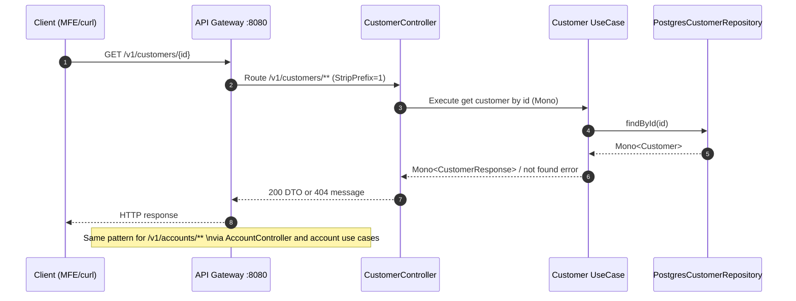

# MSA PoC (Spring Boot + Reactive DDD)

Microservices proof-of-concept for the Angular MFE app in `mfe-poc`.

It implements the backend contract used by the frontends for:

- `GET /v1/customers`
- `GET /v1/customers/{id}`
- `GET /v1/accounts`
- `GET /v1/accounts/{id}`

The project is built with a reactive Spring Boot stack and a DDD-inspired structure.

## Architecture

```text
Angular MFEs (4200/4201/4202)
          |
          v
   API Gateway (8080)
      /v1/customers/**  -> customers-service (8081)
      /v1/accounts/**   -> accounts-service  (8082)
```

### Microservice request flow schema

```text
Client (MFE / curl)
  |
  | HTTP GET /v1/customers/{id}
  v
API Gateway (gateway-service, 8080)
  |
  | Route by path predicate (/v1/customers/**)
  | StripPrefix=1
  v
customers-service (8081)
  [interfaces] Account/Customer Controller (REST endpoint)
  |
  v
  [application] Use Case (application service)
  |
  v
  [domain] Repository interface + domain model
  |
  v
  [infrastructure] PostgreSQL Repository (R2DBC)
  |
  v
Response DTO (or 404 mapped by ApiExceptionHandler)
  |
  v
API Gateway -> Client
```

```mermaid
flowchart TD
    C[Client\nMFE / curl] -->|GET /v1/customers/{id}| G[API Gateway\ngateway-service:8080]
    G -->|Path /v1/customers/**\nStripPrefix=1| S[customers-service:8081]
    S --> I[interfaces\nCustomerController]
    I --> A[application\nGetCustomerByIdUseCase / ListCustomersUseCase]
    A --> D[domain\nCustomer + CustomerRepository]
    D --> R[infrastructure\nPostgresCustomerRepository]
    R --> E[Response DTO / Not Found]
    E --> G
    G --> C

    G -->|Path /v1/accounts/**\nStripPrefix=1| SA[accounts-service:8082]
    SA --> IA[interfaces\nAccountController]
    IA --> AA[application\nGetAccountByIdUseCase / ListAccountsUseCase]
    AA --> DA[domain\nAccount + AccountRepository]
    DA --> RA[infrastructure\nPostgresAccountRepository]
    RA --> EA[Response DTO / Not Found]
    EA --> G
```



Same flow applies to `/v1/accounts/**`, routed to `accounts-service` (8082).

### Modules

- `gateway-service`
  - Spring Cloud Gateway
  - Routes `/v1/customers/**` and `/v1/accounts/**`
  - Central CORS for local MFE origins
- `customers-service`
  - Reactive WebFlux API + reactive use cases
  - DDD layers: domain, application, infrastructure, interfaces
  - PostgreSQL adapter via R2DBC (`PostgresCustomerRepository`)
- `accounts-service`
  - Reactive WebFlux API + reactive use cases
  - DDD layers: domain, application, infrastructure, interfaces
  - PostgreSQL adapter via R2DBC (`PostgresAccountRepository`)

## DDD layering used in each bounded context

Each business service (`customers-service`, `accounts-service`) follows this package structure:

- `domain`
  - Entities/value objects and repository interfaces
- `application`
  - Use cases (application services) orchestrating domain operations
- `infrastructure`
  - Reactive PostgreSQL repository implementations (PoC persistence)
- `interfaces`
  - REST controllers, DTOs, and API exception mapping

This keeps transport/infrastructure concerns separate from core domain logic.

## Implemented API contract

### Customers

- `GET /v1/customers`
  - Query params: `page` (default `0`), `size` (default `20`, max `100`)
  - Response: list of `{ id, name, email, status }`
- `GET /v1/customers/{id}`
  - `404` body: `{ "message": "Customer not found" }`

### Accounts

- `GET /v1/accounts`
  - Query params: `page` (default `0`), `size` (default `20`, max `100`)
  - Response: list of `{ id, accountNumber, type, balance, currency, ownerId }`
- `GET /v1/accounts/{id}`
  - `404` body: `{ "message": "Account not found" }`

## Prerequisites

- Java 21+
- Maven 3.9+

## How to run

Open 3 terminals in `msa-poc`:

Start PostgreSQL databases first:

```bash
docker compose up -d
```

Then open 3 terminals in `msa-poc`:

```bash
# Terminal 1
mvn -pl customers-service spring-boot:run

# Terminal 2
mvn -pl accounts-service spring-boot:run

# Terminal 3
mvn -pl gateway-service spring-boot:run
```

Services:

- Gateway: `http://localhost:8080`
- Customers: `http://localhost:8081`
- Accounts: `http://localhost:8082`

Databases:

- Customers PostgreSQL: `localhost:5433` (`customersdb`)
- Accounts PostgreSQL: `localhost:5434` (`accountsdb`)

### Quick smoke checks

```bash
curl http://localhost:8080/v1/customers
curl "http://localhost:8080/v1/customers?page=0&size=10"
curl http://localhost:8080/v1/customers/c-001
curl http://localhost:8080/v1/accounts
curl "http://localhost:8080/v1/accounts?page=1&size=10"
curl http://localhost:8080/v1/accounts/a-001
```

## Unit testing

Run all tests from root:

```bash
mvn test
```

Run per module:

```bash
mvn -pl customers-service test
mvn -pl accounts-service test
mvn -pl gateway-service test
```

### What is covered

- **Use case tests** for application logic
- **Repository tests** for reactive repository contracts
- **Controller tests** for REST contract + not-found behavior
- **Gateway context test**

## Notes

- Business services are fully reactive (`Mono`/`Flux`) from controller to repository contract.
- Persistence uses PostgreSQL with reactive R2DBC adapters.
- Seed data includes 100 customers and 100 accounts to support pagination testing.
- Optional fallback: enable `in-memory` profile to use seeded in-memory repositories.
- API Gateway path prefix `/v1` matches frontend expectations from `mfe-poc`.

## Reactive + SQL compliance checklist

- ✅ `customers-service` is reactive end-to-end (WebFlux + `Flux`/`Mono`).
- ✅ `accounts-service` is reactive end-to-end (WebFlux + `Flux`/`Mono`).
- ✅ Both microservices use SQL databases (PostgreSQL) for PoC runtime.
- ✅ README and implementation instructions are aligned with reactive + PostgreSQL architecture.
- ⚠️ Final runtime verification (`mvn test`) depends on local Maven availability.
